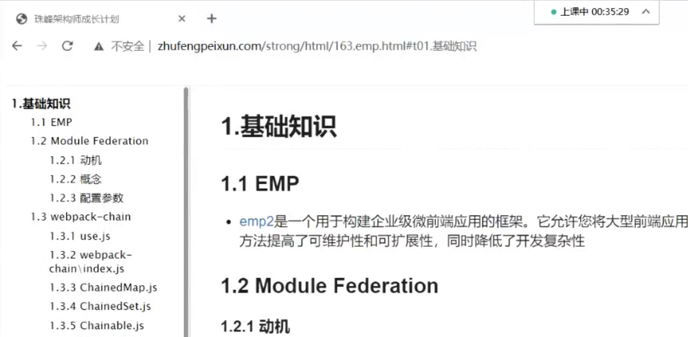
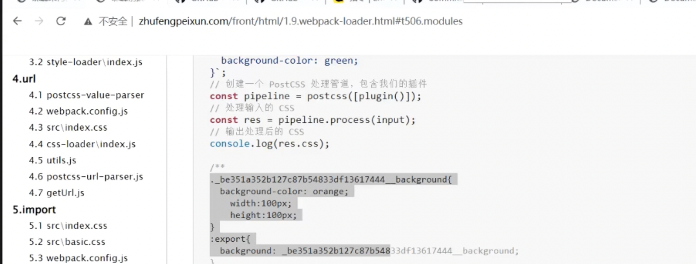

样式隔离咋搞 cssmodules
不涉及跨域，因为加载的是js
这种微前端不能够跨框架吧？可以 但不建议
远程模块都是挂全局的嘛，如果重名了....多个小组，不同的小组肯定 需要有自己名称，约定一下
这样的实现方式对微前端很有用，如果项目多的话发包到npm后其他项目也的重新打包，但是这样的方式就不需要
发布和A组件的TS，B怎么使用呢: 参考emp2官方文档 dts生成与同步

实现css modules局部作用域: 