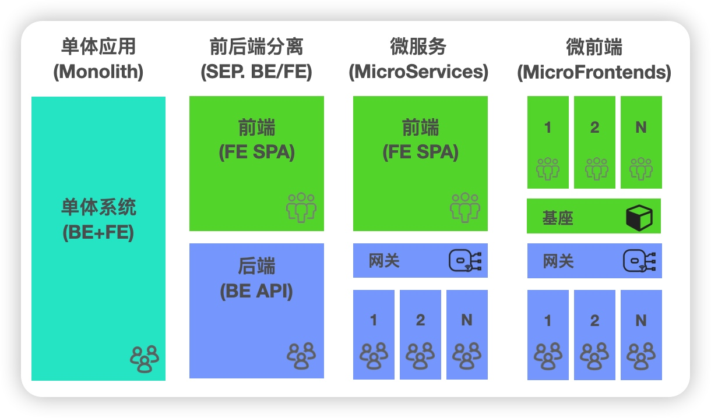
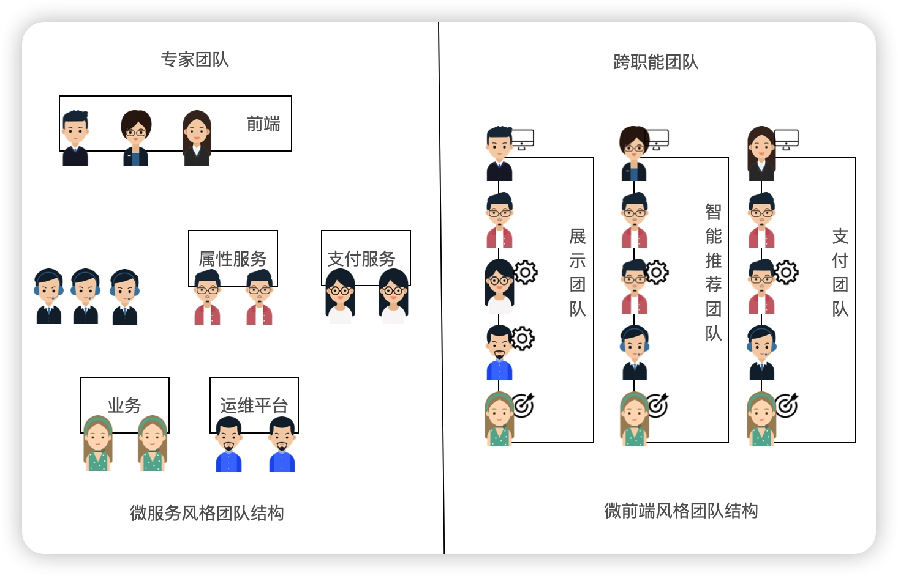
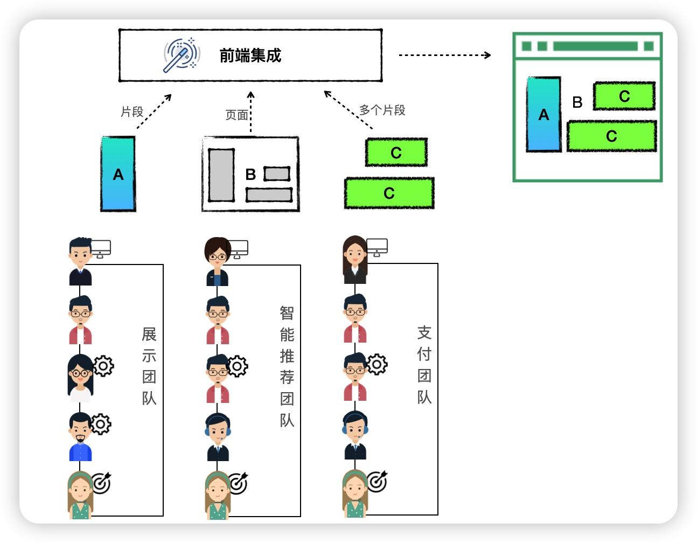
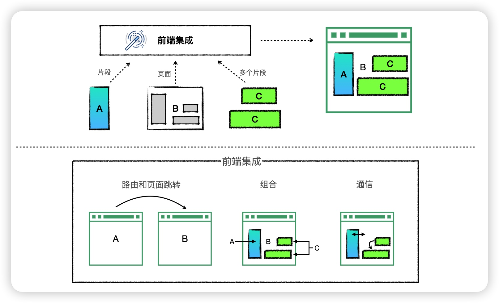
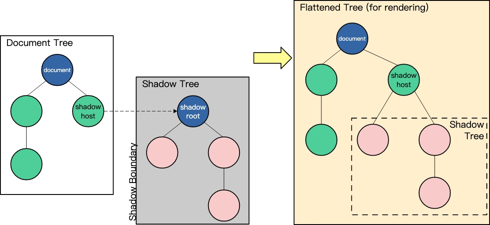
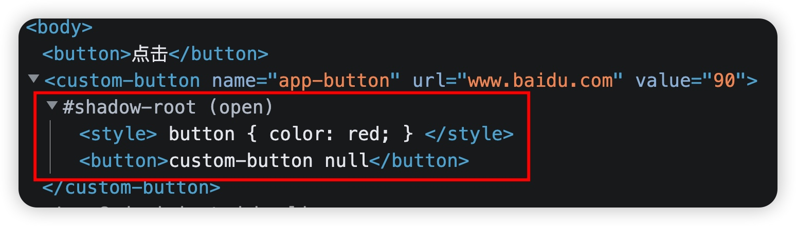
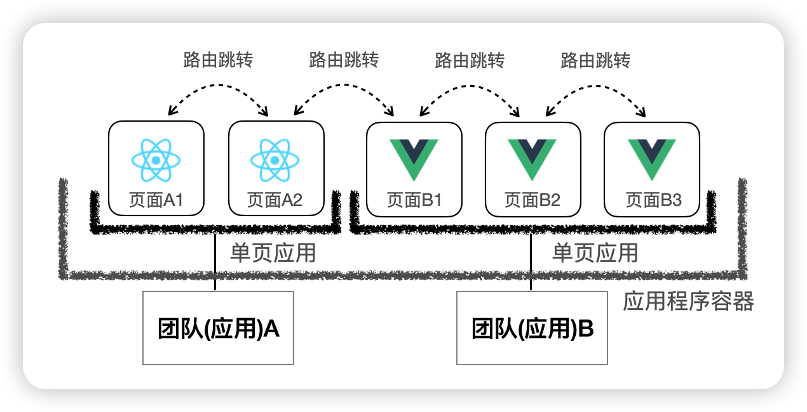
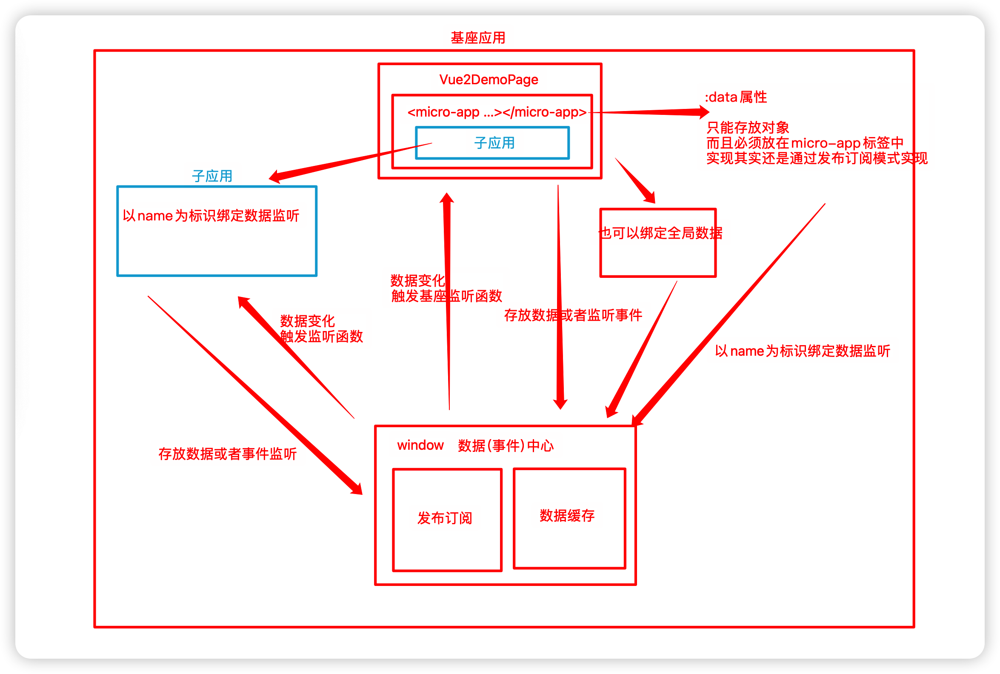

# micro-fe-book

《n 天微前端技术深度挑战》掘金专栏代码仓库，掘金专栏地址：https://juejin.cn/column/7287907234716844073

专栏所有代码位置：https://github.com/Sunny-117/micro-fe-book


# Day1 【开篇】微前端概述

## 什么是微前端？

**微前端** 这个名词，是2016年底在 [ThoughtWorks Technology Radar](https://www.thoughtworks.com/radar/techniques/micro-frontends) 被提出。这个概念天生其实就是和后端的**微服务**概念相对应的。

大家对微服务都比较熟悉了，微服务允许后端体系结构通过松散耦合的代码库进行扩展，每个代码库负责自己的业务逻辑，并公开API，每个API均可独立部署，并且各自由不同的团队拥有和维护。

现代的前端应用的发展趋势正在变得越来越富功能化，富交互化，也就是传说中的**SPA**(单页面应用)；这样越来越复杂的单体前端应用，背后的后端应用则是数量庞大的微服务集群。被一个团队维护的前端项目，随着时间推进，会变得越来越庞大，越来越难以维护。所以我们给这种应用起名为**巨石单体应用**。

在微服务的架构中，后台的服务已经按照业务进行了分离，而前端仍然是一个单体构建，通过网关来调用不同的后台服务。这个与微服务的思路是相违背的，这也就造成了你的后端团队是按照业务分割的，但是前端团队仍然是一个整体。微前端可以有效地改进这一点。

前端架构经历了从单体，到前后端分离，再到微服务，最终发展到现在的微前端，如下图




## 微前端解决了哪些问题

### 优化功能开发

微前端和其他架构最显著的区别在于团队结构。

在传统的项目架构中，功能的完成时间取决于最后一个团队的完成时间

**减少团队间的等待时间是微前端的主要目标之一**

在微前端的模型中，所有参与创建功能的人员都在同一个团队中，虽然需要完成的工作总量是相同的，但是团队内的沟通会更加的快速，可能不需要跨部门，也不需要那么正式，迭代会进行的更快。不必等待其他团队，也不必讨论任务的优先级。



### 不再有前端巨石架构

有了微前端，包括前端在内的应用程序被分割成更小的垂直系统。每个团队都有自己的一小块前端。这与一个前端巨石应用相比，构建和维护一个较小的前端更具有优势

### 能更快的适用变化

处理**遗留系统**在前端也日益成为一个较普遍的话题。开发人员要花费大量时间重构遗留代码和执行迁移策略，这将花费公司大量精力。

技术是在不断发展的，当你构建特定规模的应用程序，并希望保持竞争力时，如果新技术能为你的团队提供价值，那么能够自由的转向新技术，并且还能将试错的成本保持最小，这至关重要。

如果使用微前端，那么就意味着你不需要每隔几年重写整个前端项目以使用当前流行的技术，微前端的每一块应用都可以**本地决策**。我们甚至可以先拿出一个应用模块进行试错，然后直接整合到现有的平台上即可。

### 自主的优势

**微服务架构的核心优势之一是自治，微前端也是这样**

如果某一个应用团队需要更新某个新的功能，这个功能可能甚至导致整个JS框架的升级。在微前端框架中，你完全不必纠结，直接处理就行。但是如果是以前的巨石应用，那就是一个头痛的大问题了。你不知道要协调多少部门，多少人员，多少代码。

团队之间的沟通是昂贵的，当你想要更改别人的一段代码，即使只是一个工具库，也需要通知所有人，等待他们的反馈，也许还要讨论其他的选项。参与的人越多，处理起来越麻烦。

## 微前端的核心价值

微前端所解决的问题，正是它所体现的核心价值所在，总结其实就是下面几点：

- 技术栈无关

- 可独立开发、部署

- 增量升级

- 独立运行时

## 微前端架构的实现方式

无论如何，微前端架构需要落地的实现，我们划分了之前的垂直体系的团队结构，而每个团队的前端页面，我们最终都需要整合集成，将所有内容组装到一起。而且很多时候，也并不是每个团队提供的都是一整个页面，可能是一个页面，也可能是一个或者多个页面的片段，根据具体的业务需求来整合集成。



因此这种前端的集成，我们大体也就分为三类，**路由、组合和通信**



我们可以通过路由，直接跳转到其他子应用，这个过程可以做的很简单，一个超链接搞定。也可以把每一个子应用看成一个SPA的单页应用，然后我们进行路由单页跳转。

也可以再页面进行组合，比如简单点使用iframe嵌套，也可以使用最新的HTML5的API，web component把每一个应用做成一个组件进行嵌套。

如果页面有一些比较复杂的业务，需要应用之间传递信息，然后获取不同的页面效果，那么就需要页面之间的通信。

## 微前端架构的解决方案

* iframe
* single-spa
* web component
* webpack5 模块联邦

## 国内常见的微前端框架

集成了页面，还有一大堆事情要做：

* CSS样式隔离：不同项目，相同的样式名在页面中是会相互污染的
* js隔离：不同项目，在向window挂在变量时，有可能会互相污染
* 路由状态：子应用的路由改变需要同步到主应用上
* 通信方式：子应用之间互相通信也是必不可少的，要尽量解耦不要互相调用。
* 预加载：利用用户浏览空闲时间，提前加载其他项目的JS文件，提高用户体验
* ......

这些都是页面集成之后需要去解决的问题。当然了现在市面上已经有了一些比较成熟的微前端框架.

* qiankun
* micro-app
* 无界
* ......

不过即使有了这些框架，并不能解决我们所有企业在微前端中遇到的问题，包括微前端自己，也并非一颗银弹。因此，我们学习的重心不是在这些框架应该怎么使用，应该去探究这些框架底层是如何实现的。这样以后如果出现了问题，我们也能脱离框架，自行解决。


# Day2 【革命性】Web Component

Web Component是HTML5推出的一个新特征，顾名思义就是web组件，Web Component是一个概括性的术语。它描述的其实是三种不同的全新的API：**自定义元素，Shadow DOM和HTML模板**

* 自定义元素。 在 HTML 基础标签外扩展自定义标签元素
* Shadow DOM。 主要用于将 Shadow DOM 的内容与外层 document DOM 隔离
* HTML 模板。 使用 `<template>` 来定义组件模板，使用 `<slot>` 作为插槽使用

### Custom Elements
自定义元素，Shadow DOM和HTML 模板其实还有很多API细节，这里就不再一一的去讲解了，主要通过案例让大家了解`Web Component`，方便我们后面分析微前端框架的源码.

首先是如何创建一个[Custom Element](https://developer.mozilla.org/zh-CN/docs/Web/API/Web_components/Using_custom_elements)

创建一个最基本的`Custom Element`
```js
class CustomButton extends HTMLElement {
  constructor() {
    super();
    let value = this.getAttribute("value");
    // 可以直接放入到innerHTML中
    // this.innerHTML = `<button>custom-button ${value}</button>`

    // 也可以通过appendChild的方式添加元素对象
    let btn = document.createElement("button");
    btn.innerHTML = `custom-button ${value}`;
    btn.addEventListener('click', () => { 
      this.setAttribute("name", "test");
      this.setAttribute("value", 89);
    })
    this.appendChild(btn);
  }
  // 当 custom element首次被插入文档DOM时，被调用
  connectedCallback() {
    console.log("connectedCallback");
  }
  // 当 custom element从文档DOM中删除时，被调用
  disconnectedCallback() {
    console.log("disconnectedCallback");
  }
  // 当 custom element增加、删除、修改自身属性时，被调用
  attributeChangedCallback(name, oldValue, newValue) {
    console.log("attribute", name, oldValue, newValue);
  }
  // 声明需要监听的属性名，只有这些属性变化时才会触发attributeChangedCallback
  static get observedAttributes() {
    return ["name", "url", "value"];
  }
}
//参数一：自定义元素名，格式有要求：短线连接的字符串
//参数二：自定义元素构造器
//参数三：可选，含有 extends 属性的对象。指定所创建的元素继承自哪个内置元素，可以继承任何内置元素
window.customElements.define("custom-button", CustomButton);
```
**界面使用**
```js
<!DOCTYPE html>
<html lang="en">
  <body>
    <button>点击</button>
    <custom-button
      name="app-button"
      url="www.baidu.com"
      value="90"
    ></custom-button>
  </body>
  <script src="test.js"></script>
  <script>
    const customButton = document.querySelector("custom-button");
    //要注意，写在这里是整个自定义元素的事件，也就是说，自定义元素里面的每一个元素，都会触发click事件
    customButton.addEventListener("click", function (e) {
      this.setAttribute("name", "test");
      this.setAttribute("value", 99);
    });
  </script>
</html>
```
### Shadow DOM

[Shadow DOM](https://developer.mozilla.org/zh-CN/docs/Web/API/Web_components/Using_shadow_DOM) 是 `Web components` 的一个重要属性是封装——可以将标记结构、样式和行为隐藏起来，并与页面上的其他代码相隔离，保证不同的部分不会混在一起，可使代码更加干净、整洁。其中，Shadow DOM 接口是关键所在，它可以将一个隐藏的、独立的 DOM 附加到一个元素上。



```js
class CustomButton extends HTMLElement {
  constructor() {
    super();
    let btn = document.createElement("button");
    btn.innerHTML = `custom-button ${value}`;
    //其他代码省略只保留关键代码...
    
    
    //创建Shadow DOM时，可以选择open或closed模式，
    //close会对外部DOM隐藏shadowRoot,这可以防止其他脚本对DOM的以外操作
    //但是也会阻止爬虫看到里面的内容，除非有特殊需求，建议默认open
    this.attachShadow({ mode: "open" });
    //这里的样式，只会作用域当前的shadowRoot中，不会影响到外部的DOM
    this.shadowRoot.innerHTML = `
      <style>
        button {
          color: red;
        }
      </style>
    `;
    this.shadowRoot.appendChild(btn);
  }
  //其他代码省略只保留关键代码
}
```



### HTML 模板
[HTML 模板](https://developer.mozilla.org/zh-CN/docs/Web/API/Web_components/Using_templates_and_slots)其实包含了`template`和`slot`两个标签

**界面**
```
<template id="add-template">
  <input type="text">
  <button>新增</button>
</template>
```

**JS**
```js
class CustomButton extends HTMLElement {
  constructor() {
    super();
    let value = this.getAttribute("value");
    
    let templateEle = document.getElementById("add-template");
    let cloneEle = templateEle.content.cloneNode(true);
    cloneEle.querySelector("input[type='text']").value = `${value}`;

    let btn = document.createElement("button");
    btn.innerHTML = `custom-button ${value}`;
    btn.addEventListener('click', () => { 
      this.setAttribute("name", "test");
      this.setAttribute("value", 89);
    })
    
    this.attachShadow({ mode: "open" });
    this.shadowRoot.innerHTML = `
      <style>
        button {
          color: red;
        }
      </style>
    `;
    this.shadowRoot.appendChild(btn);
    
    this.shadowRoot.appendChild(cloneEle);
  }
}
```

还能使用`slot`插槽
```html
<template id="add-template">
  <slot name="title"></slot>
  <input type="text">
  <button>新增</button>
</template>

<custom-button
  name="app-button"
  url="www.baidu.com"
  value="90"
>
  <div slot="title">
    <h2>新增</h2>
  </div>
</custom-button>
```

### 示例
```js
class ImageBox extends HTMLElement { 
  constructor() { 
    super();
    this.render();
  }
  render() { 
    let url = this.getAttribute('url');
    let title = this.getAttribute('title');
    let price = this.getAttribute('price');

    this.attachShadow({ mode: 'open' });
    const imageBoxTemplate = document.getElementById('image-box-template');
    const imageBoxContent = imageBoxTemplate.content.cloneNode(true);

    imageBoxContent.querySelector("img").setAttribute('src', url);
    imageBoxContent.querySelector("div.title").innerHTML = title;
    imageBoxContent.querySelector("div.price").innerHTML = `￥${price}`;

    imageBoxContent.querySelector("div.action").addEventListener('click', (e) => { 
      let target = e.target;
      if (target.classList.contains('primary')) {
        alert("预定成功")
      }
      else { 
        alert("加入购物车成功")
      }
    });

    this.shadowRoot.appendChild(imageBoxContent);
  }
}

window.customElements.define('image-box', ImageBox);
```

**界面：**
```html
<!DOCTYPE html>
<html lang="en">
  <head>
    <meta charset="UTF-8" />
    <meta http-equiv="X-UA-Compatible" content="IE=edge" />
    <meta name="viewport" content="width=device-width, initial-scale=1.0" />
    <title>Document</title>
    <style>
      .content{
        display: flex;
        flex-wrap: wrap;
      }
      .btn{
        display: inline-block;
        padding: 6px 12px;
        background-color: #ccc;
        border: 1px solid transparent;
        border-radius: 5px;
        color: #fff;
        text-decoration: none;
        font-size: 14px;
        line-height: 1.42857143;
        cursor: pointer;
      }
      .btn:hover{
        background-color: #286090;
        border-color: #204d74;
      }
      .primary{
        background-color: #409eff;
      }
      .success{
        background-color: #67c23a;
      }
    </style>
  </head>
  <body>
    <template id="image-box-template">
      <style>
        .image-box {
          width: 200px;
          height: 200px;
          border: 1px solid #ccc;
          margin: 10px;
          padding: 10px;
          box-sizing: border-box;
          transition: all 0.5s;
        }
        .image-box:hover {
          box-shadow: 3px 3px 3px rgba(0, 0, 0, 0.3);
        }
        .image-box .img {
          width: 100%;
          height: 100%;
          transition: all 0.5s;
        }
        .image-box .img:hover {
          transform: scale(1.05, 1.05);
        }
        .image-box .title {
          font-size: 20px;
          font-weight: bold;
          margin: 10px 0;
        }
        .image-box .content {
          font-size: 16px;
          color: #666;
        }
      </style>
      <div class="image-box">
        
        <div class="title"></div>
        <div class="price"></div>
        <div class="action">
          <slot name="btn-action"></slot>
        </div>
        
      </div>
    </template>

    <div class="content">
      <image-box
        url="./images/奥利奥奶茶.jpeg"
        title="奥利奥奶茶"
        price="18"
      >
        <button slot="btn-action" class="btn primary">预定</button>
      </image-box>
      <image-box
        url="./images/奥利奥蛋糕.jpeg"
        title="奥利奥蛋糕"
        price="20"
      >
        <button slot="btn-action" class="btn success">购买</button>
      </image-box>
    </div>
    
  </body>
  <script src="index.js"></script>
</html>
```


# Day3 【快速掌握】Micro-app 框架

## 使用框架基调



## 1、框架安装

```js
npm i @micro-zoe/micro-app --save
```

## 2、子应用对应的view页面

```html
<template>
  <div>
    <!-- 
      name(必传)：应用名称
      url(必传)：应用地址，会被自动补全为http://localhost:3000/index.html
      baseroute(可选)：基座应用分配给子应用的基础路由，就是上面的 `/my-page`
     -->
     <micro-app 
      name='app-vue2-demo' 
      url='http://localhost:4001/' 
      baseroute='/app-vue2-demo'
     >
    </micro-app>
  </div>
</template>
```

## 3、页面对应的路由

```js
{
      //路由路径最好是非严格匹配
      path: "/app-vue2-demo*",
      name: "Vue2DemoPage",
      component: () => import("@/views/Vue2DemoPage.vue")
}
```

别忘记，view页面也需要配置

## 4、子应用的配置

子程序路由需要判断是否加上主程序给予的路由前缀

```
const router = new VueRouter({
  mode: "history",
  base: window.__MICRO_APP_BASE_ROUTE__ || '/',
  。。。。。
 }
```

## 5、子程序需要设置跨域

```js
devServer: {
    port: 4001,
    headers: {
      'Access-Control-Allow-Origin': '*',
    }
}
```


### 配置总结

主应用

1、创建一个页面，需要加入micro-app自定义元素

2、配置路由

子应用

1、如果在微前端中，加上路由前缀

2、设置跨域

#### 页面渲染实现原理

其实micro-app原理很简单：WebComponent(Custom Element) + HTMLEntry

其实就是把子应用的资源读取过来，直接在基座程序中运行


### 与react子应用集成

主应用

1、创建一个页面，需要加入micro-app自定义元素

```
<micro-app 
      name='app-react-demo' 
      url='http://localhost:4002/' 
      baseroute='/app-react-demo'
>
</micro-app>
```


2、配置路由

```js
{
      //路由路径最好是非严格匹配
      path: "/app-react-demo*",
      name: "ReactDemoPage",
      component: () => import("@/views/ReactDemoPage.vue")
    }
```


子应用

1、如果在微前端中，加上路由前缀

```js
<Router basename={window.__MICRO_APP_BASE_ROUTE__ || '/'}>
        <Routes>
          <Route path="/" element={<LayoutMain />} > 
            <Route index element={<Home />} />
            <Route path="about" element={<About />} />
            <Route path="info" element={<Info />} />
          </Route>
        </Routes>
      </Router>
```

2、设置跨域

```js
headers: {
      'Access-Control-Allow-Origin': '*',
},
```

3、静态资源的处理

在子应用中的src下创建public-path.js文件

```js
if (window.__MICRO_APP_ENVIRONMENT__) {
  // eslint-disable-next-line
  __webpack_public_path__ = window.__MICRO_APP_PUBLIC_PATH__ //http://localhost:4002  默认/
}
```

这个文件放入到程序的入口文件index.js中直接执行，建议最好放在第一行

```js
import "./public-path";
```


### 与vite项目子应用集成

当子应用是vite应用时需要做特别的适配，适配vite的代价是巨大的，我们必须关闭沙箱功能，因为沙箱在`module script`下不支持，这导致大部分功能失效，包括：环境变量、样式隔离、元素隔离、资源路径补全、baseroute 等。

在嵌入vite子应用时，`micro-app`的功能只负责渲染，其它的行为由应用自行决定，这包括如何防止样式、JS变量、元素的冲突。

在module模式下，引入的资源大多为相对地址，兼容主要做的事情就是将地址补全。

> vite的module模式是指vite在开发模式下直接使用ES模块来加载代码，而不是像传统的构建工具一样通过打包和压缩，将所有代码打包成一个文件。这种模式让我们开发的时候效率很高，不过却给微前端的集成带来了麻烦
>
> 因为我们之前说过micro-app集成的原理，就是把子应用打包好的index.html直接拉过来，然后在基座中运行子应用的代码。vite 这种module模式的话。缺少了这个统一的入口，集成起来就非常的麻烦

#### 1、基座项目中添加页面

views中添加页面ViteDemoPage.vue

```html
<template>
  <div>
    <h2>Main - Vite Vue3 Demo</h2>
    <div>
      <micro-app name='app-vite-demo' url='http://localhost:4003/' baseroute='/app-vite-demo'></micro-app>
    </div>
  </div>
</template>
```

路由中添加：

```ts
{
      path: "/app-vite-demo*",
      name: "AppViteDemo",
      component: () => import("@/views/ViteDemoPage.vue")
 }
```

app.vue页面别忘记添加路由

#### 2、适配vite项目，子应用修改vite.config.ts文件

无论micro-app框架还是single-spa框架，适配vite项目代价都很大，如果你要集成的项目很多是vite项目，建议直接使用iframe的方式接入，或者使用wujie

这里主要说明两点：

1、path如果报错，需要导入nodejs的TypeScript 的声明文件包 npm i --save-dev @types/node

2、赋值的自定义插件报错，直接any

```js
import { defineConfig } from 'vite'
import vue from '@vitejs/plugin-vue'
import { resolve } from 'path';
import { join } from 'path'
import { writeFileSync } from 'fs'

// https://vitejs.dev/config/
export default defineConfig({
  //域名，生成环境是是你具体的域名，开发环境下为空字符串，这里手动加上了微前端的路由前缀
  base: `${process.env.NODE_ENV === 'production' ? 'http://my-site.com' : ''}/app-vite-demo/`,
  plugins: [
    vue(),
    // 自定义插件
    (function () {
      let basePath = ''
      return {
        name: "vite:micro-app",
        apply: 'build',
        configResolved(config) {
          //配置资源文件基础路径
          //${config.base} 项目基础路径，就是上面配置的那些
          //${config.build.assetsDir}资源文件存放的目录名。默认情况下，它是 'assets'
          basePath = `${config.base}${config.build.assetsDir}/`
        },
        writeBundle (options, bundle) {
          //遍历所有的代码块，找到文件名以 '.js' 结尾的代码块
          for (const chunkName in bundle) {
            if (Object.prototype.hasOwnProperty.call(bundle, chunkName)) {
              const chunk = bundle[chunkName]
              if (chunk.fileName && chunk.fileName.endsWith('.js')) {
               //使用正则表达式来查找所有的相对路径，并使用 new URL() 方法将这些路径转换为绝对路径。
                chunk.code = chunk.code.replace(/(from|import\()(\s*['"])(\.\.?\/)/g, (all, $1, $2, $3) => {
                  return all.replace($3, new URL($3, basePath))
                })
       //options.dir Vite 构建过程中的输出目录，默认情况下，options.dir 的值就是 dist
      //options.dir 是 dist，chunk.fileName 是 main.js，那么完整的文件路径就是 dist/main.js
                const fullPath = join(options.dir, chunk.fileName)
                //将修改后的内容，重新写入文件系统
                writeFileSync(fullPath, chunk.code)
              }
            }
          }
        },
      }
    })() as any,
  ],
  resolve: {
    alias: {
      '@': resolve(__dirname, 'src') // 设置 `@` 指向 `src` 目录
    }
  },
  server: {
    port: 4003,
  }
})
```

#### 3、子项目修改容器id和渲染容器id

```html
<!-- index.html -->
<body>
  <div id="my-vite-app"></div>
</body>
```

```ts
// main.ts
createApp(App).mount('#my-vite-app')
```

#### 4、修改路由

vite子项目需要修改为**hash路由**

由于主应用关闭的沙箱功能，所以基座应用的环境变量不能使用了，所以，每次切换路由的时候就会产生问题

由于hash路由，使用的是地址栏的处理

```js
import { createRouter, createWebHashHistory } from 'vue-router'

const router = createRouter({
  history: createWebHashHistory(),
  routes,
})
```

#### 5、静态资源

```js
<template>
  <div>
    <div>
      <a href="https://vitejs.dev" target="_blank">
        
      </a>
      <a href="https://vuejs.org/" target="_blank">
        
      </a>
    </div>
    <HelloWorld msg="子应用 -- Vite+Vue@3.x" />
  </div>
</template>

<script setup lang="ts">
import HelloWorld from '@/components/HelloWorld.vue'
const vueLogo = new URL('@/assets/vue.svg', import.meta.url).href
const viteLogo = new URL('/vite.svg', import.meta.url).href
</script>
```

如果图片比较多，可以用计算属性稍微封装一下

```js
<template>
  <div>
    <div>
      <a href="https://vitejs.dev" target="_blank">
        
      </a>
      <a href="https://vuejs.org/" target="_blank">
        
      </a>
    </div>
    <HelloWorld msg="子应用 -- Vite+Vue@3.x" />
  </div>
</template>

<script setup lang="ts">
import {computed} from 'vue'
import HelloWorld from '@/components/HelloWorld.vue'
// const vueLogo = new URL('@/assets/vue.svg', import.meta.url).href
// const viteLogo = new URL('/vite.svg', import.meta.url).href

const imgUrl = computed(() => (url: string) => new URL(url, import.meta.url).href);
</script>
```

#### 6、基座应用的修改，关闭沙箱功能

```js
<micro-app 
  name='app-vite-demo' 
  url='http://localhost:4003/' 
  baseroute='/app-vite-demo'
  inline 
  disableSandbox
 >
 </micro-app>
```

#### 7、基座应用处理子应用静态资源

```js
microApp.start({
  plugins: {
    modules: {
      // appName即应用的name值,注意这里的name实际上是页面<micro-app>标签的name值
      'app-vite-demo': [{
        loader(code) {
          if (process.env.NODE_ENV === 'development') {
            // 这里 basename 需要和子应用vite.config.js中base的配置保持一致
            code = code.replace(/(from|import)(\s*['"])(\/app-vite-demo\/)/g, all => {
              return all.replace('/app-vite-demo/', 'http://127.0.0.1:4003/app-vite-demo/')
            })
          }
          return code
        }
      }]
    }
  }
})
```

#### 8、出现的问题


**开发者工具console窗口报错**

```js
[vite] failed to connect to websocket (SyntaxError: Failed to construct 'WebSocket': The URL 'ws://:/app-vite-demo/' is invalid.)
```

这个是由于框架自身问题导致，不影响运行，官方已经在1.0beta版本修复了这个问题

**由于沙箱隔离关闭，导致环境变量，css隔离，元素隔离、资源路径补全、baseroute等失效**

这个问题只有开发者在开发的时候自行定义好开发规范进行规避


### requestIdleCallback

requestIdleCallback浏览器渲染一帧的剩余空闲时间执行优先度相对较低的任务

页面是通过一帧一帧渲染出来的，通常60FPS是流程的，和浏览器刷新同步。这就意味着：**一秒之内要进行60次渲染，每次重新渲染的时间不能超过16.66(1000/60)毫秒**

浏览器一帧做了什么事情？

顺序

- 用户事件

- js事件轮询
- begin frame
  - window.resize
  - scroll
  - 媒体查询
  - 动画时间
- requestAnimationFrame（在每次渲染之前执行，不会重新触发浏览器重绘）
- 浏览器渲染
  - 样式计算
  - 布局
  - 重绘
  - 合成
- requestIdleCallback(空闲时间)

## 数据通信


实现原理 数据中心(发布订阅+数据缓存)



### 父应用直接传递

```
<micro-app 
	......
	:data='dataForChild'
>
</micro-app>

export default {
  data () {
    return {
      dataForChild:{type:'发送给子应用的数据'}
    }
  },
 }
```


### 子应用直接获取

```
<button @click="handleData">获取父应用传递数据</button>

methods: {
    handleData() { 
      const data = window.microApp.getData()
      console.log(data);
    },
}
```

### 子应用发送消息给父应用

```
<button @click="sendData">子应用反馈数据</button>

methods: {
    sendData() { 
      window.microApp.dispatch({type: '子应用发送的数据'})
    }
  }
 }
```

### 父应用直接接收消息

```
<micro-app 
  ......
  @datachange='handleDataChange'
>
</micro-app>

handleDataChange (e) {
	console.log('来自子应用的数据：', e.detail.data);
	//ele通知
	this.$notify({
    title: '子应用信息',
    message: e.detail.data.type,
    position: 'top-left'
  });
}
```


### 父应用主动发送信息给子应用

在vue2DemoPage页面发送消息

```
<button @click="sendDataToVue2">父应用-发送数据给app-vue2-demo</button>

import microApp from '@micro-zoe/micro-app'
sendDataToVue2() { 
   microApp.setData('app-vue2-demo', {type: '发送新的数据',path:"/about"})
}
```


### 子应用监听父应用发送的消息

```js
//element ui将通知挂载到Vue.prototype上，vue实例可以通过this获取，在main函数中，可以直接导入Notification
import { Notification } from 'element-ui';
// 与基座进行数据交互
function handleMicroData () {
  // 是否是微前端环境
  if (window.__MICRO_APP_ENVIRONMENT__) {
    // 主动获取基座下发的数据
    console.log('vue2-demo getData:', window.microApp.getData())

    // 监听基座下发的数据变化
    window.microApp.addDataListener((data) => {
      console.log('vue2-demo addDataListener:', data)
      Notification({
        title: '子应用信息',
        message: data.type,
        position: 'bottom-right'
      });

      // 当基座下发path时进行跳转
      if (data.path && data.path !== router.currentRoute.path) {
        router.push(data.path)
      }
    })
  }
}

let app = null
// 👇 将渲染操作放入 mount 函数 -- 必填
function mount () {
  app = new Vue({
    router,
    render: h => h(App),
  }).$mount('#app')
  handleMicroData();
}
```


### 子应用主动发送消息

和上面一样，只是这里基座应用通过事件监听获取，并且根据子应用发送的地址基座路由进行跳转

```
sendData() { 
	window.microApp.dispatch({type: '子应用发送的数据', path:"/app-react-demo/about"})
}
```

### 基座应用监听

```js
microApp.addDataListener('app-vue2-demo', (data) => { 
  console.log("基座主动监听", data);
  Vue.prototype.$notify({
    title: '子应用信息',
    message: data.type,
    position: 'bottom-left'
  });

  // 当收到子应用发path时进行跳转
  if (data.path && data.path !== router.currentRoute.path) {
    router.push(data.path)
  }
})
```

