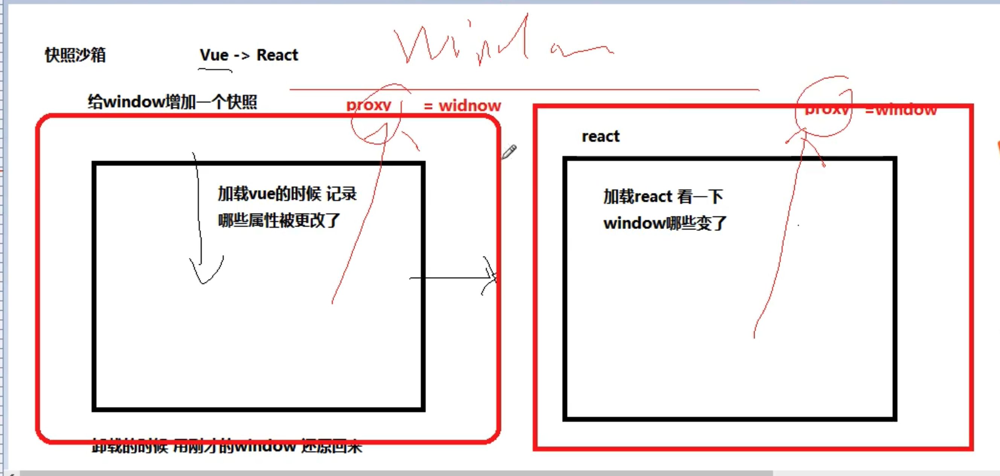
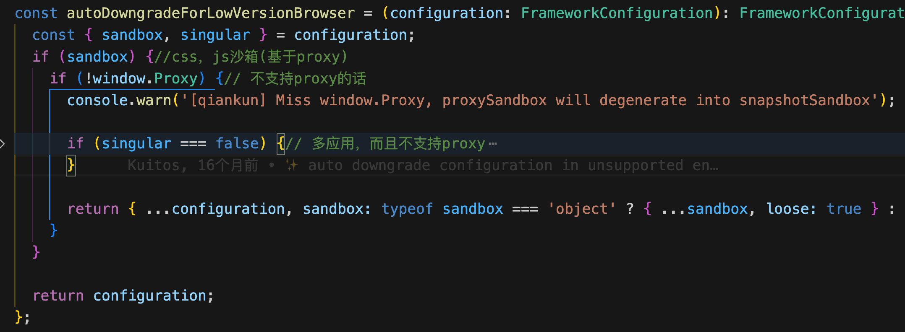

# qiankun

重点看qiankun的沙箱源码，比较简单

https://juejin.cn/post/7016900744695513125

https://www.garfishjs.org/

https://www.google.com/search?q=%E5%A6%82%E4%BD%95%E5%AE%9E%E7%8E%B0js%E6%B2%99%E7%AE%B1&oq=%E5%A6%82%E4%BD%95%E5%AE%9E%E7%8E%B0jssha&aqs=chrome.1.69i57j0i30i546i625j0i30i395i546i625l4.7021j1j1&sourceid=chrome&ie=UTF-8

## 沙箱

https://juejin.cn/post/6920110573418086413#heading-6
https://juejin.cn/post/7116339848109096974
https://www.cnblogs.com/sexintercourse/p/16980569.html
https://hijiangtao.github.io/2022/06/11/JavaScript-Sandbox-Mechanism-and-Its-History/

### 单例，快照沙箱：

### 多例，proxy

以上，所以

